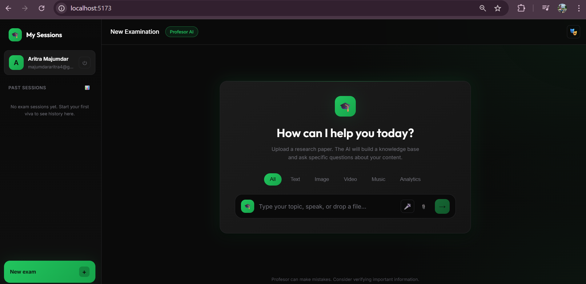
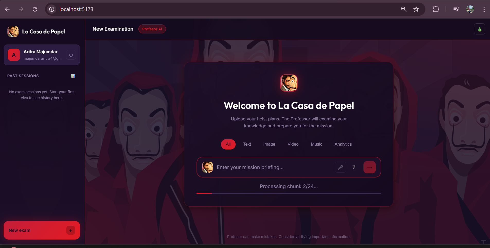

# Profesor

An AI-powered academic viva voce examination simulator. Upload a research paper (PDF) and be rigorously questioned by **Profesor** — a stern AI examiner who tests your understanding of the material.

  

## 📸 Screenshots

| Normal Theme | Profesor Theme (Money Heist) |
|:---:|:---:|
|  |  |

## ✨ Features

- **PDF Upload & Processing** — Upload any research paper and Profesor will analyze it
- **RAG-Powered Q&A** — Uses Retrieval-Augmented Generation for context-aware questioning
- **Viva Voce Simulation** — 5 rigorous questions testing conceptual, methodological, and critical understanding
- **Real-time Evaluation** — Get scored (1-10) with detailed feedback on each answer
- **Voice Input/Output** — Speak your answers and hear Profesor's questions in **multiple languages** (TTS/STT support)
- **Session Analytics** — Track your performance across multiple exam sessions
- **Dual Themes** — Choose between a **Normal** academic style or the **Profesor** theme inspired by the Money Heist character for a more engaging experience
- **Multiple LLM Providers** — Supports Together AI, OpenRouter, Groq,Ollama and Gemini

## 🚀 Quick Start
- https://profesor-eight.vercel.app/ (wont be working due to not providing the api keys)
### Prerequisites

- Node.js 18+
- An API key from one of the supported providers

### Installation

```bash
# Clone the repository
git clone https://github.com/YOUR_USERNAME/Profesor.git
cd Profesor

# Install dependencies
npm install

# Copy environment template
cp .env.example .env

# Add your API key to .env (choose one)
# VITE_TOGETHER_API_KEY=your_key
# VITE_OPENROUTER_API_KEY=your_key
# VITE_GROQ_API_KEY=your_key
# VITE_GEMINI_API_KEY=your_key

# Start development server
npm run dev
```

Open [http://localhost:5173](http://localhost:5173) in your browser.

## 🔑 API Key Setup

Choose **one** of these providers (in order of recommendation):

| Provider | Free Tier | Get API Key |
|----------|-----------|-------------|
| **Together AI** | $5 credit | [api.together.xyz](https://api.together.xyz/settings/api-keys) |
| **OpenRouter** | Free tier | [openrouter.ai/keys](https://openrouter.ai/keys) |
| **Groq** | 30+ req/min | [console.groq.com](https://console.groq.com/keys) |
| **Gemini** | Limited | [aistudio.google.com](https://aistudio.google.com/app/apikey) |

For **voice input**, you also need a Groq or OpenAI API key (Whisper STT).

## 📁 Project Structure

```
Profesor/
├── src/
│   ├── components/       # React components
│   │   ├── AuthScreen.jsx
│   │   ├── Dashboard.jsx
│   │   ├── ExamInterface.jsx
│   │   └── SessionAnalytics.jsx
│   ├── context/          # React contexts
│   │   ├── AuthContext.jsx
│   │   └── ThemeContext.jsx
│   ├── utils/            # Core logic
│   │   ├── gemini.js     # LLM provider integration
│   │   ├── profesor.js   # Question generation & evaluation
│   │   ├── rag.js        # RAG engine (chunking, embeddings)
│   │   ├── pdfParser.js  # PDF text extraction
│   │   └── speechUtils.js# TTS/STT utilities
│   ├── App.jsx
│   └── main.jsx
├── public/
├── .env.example
└── package.json
```

## 🛠️ Tech Stack

- **Frontend**: React 19, Vite 7
- **PDF Parsing**: pdf.js
- **LLM Integration**: Together AI, OpenRouter, Groq, Gemini APIs
- **RAG**: Custom chunking + Gemini embeddings
- **Speech**: Web Speech API (TTS) + Whisper API (STT)

## 📝 How It Works

1. **Upload** a research paper (PDF)
2. The paper is **chunked** and indexed for RAG retrieval
3. **Profesor** generates 5 viva-style questions based on the content
4. You answer each question (type or speak)
5. Answers are **evaluated** against the paper content
6. Receive a **score and feedback** for each response
7. View **session analytics** to track your progress

## 🎭 Meet Profesor

> *"I have reviewed your submitted paper. Let us see if you truly understand its contents. Answer precisely and cite the paper where relevant. We begin now."*

Profesor is deliberately stern and exacting — just like a real viva examiner. Expect:
- Probing follow-up questions
- Critical evaluation of vague answers
- No tolerance for handwaving

## 📄 License

MIT

---

Built with ❤️ for students preparing for academic examinations.
